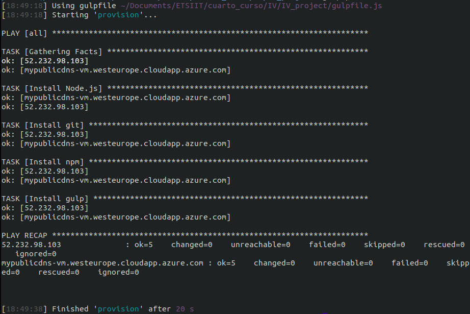

# Usando Ansible para provisionamiento y configurando Gulp

Una vez instalado Ansible, tenemos que configurarlo. 

### ansible.cfg

En primer lugar, vamos a comenzar creando su archivo de configuración: ```ansible.cfg``` con el siguiente contenido:

```python
[defaults]
host_key_checking = False
```

De esta forma estamos permitiendo que la conexión con nuevas máquinas virtuales por SSH no pregunte si se acepta la clave nueva de una MAC detectada. Luego, incluimos:

```python
inventory = ./ansible_hosts
```
Que indica dónde se va a encontrar el fichero de inventario. Dicho fichero lo creamos a continuación.

### ansible_hosts

También tenemos que incluir en el inventario ```ansible_hosts``` qué hosts van a ser provisionados. En nuestro caso hemos creado dos máquinas virtuales, una la hemos creado de forma uy elemental y otra de forma más completa:

```bash
[azure]
mypublicdns-vm.westeurope.cloudapp.azure.com

[azure_simple]
52.232.98.103
```

Como vemos, para la primera máquina, podemos llamarla por su nombre DNS. Sin embargo, para la segunda más simple, accedemos con su IP pública proporcionada por  Azure. También es cierto que podemos modificar esto y crear un alias DNS como hemos hecho para la otra máquina. 

### provision/myplaybook.yml

Por último, creamos un *playbook* indicando todo aquello que queremos que tengan las máquinas virtuales a provisionar. Los *playbooks* nos proporcionan una manera sencilla de utilizar Ansible, a través de estos podemos ejecutar tareas tal y como nosotros queramos haciendo uso del inventario que previamente hemos creado.

```yml
- hosts: all
  become: yes
  tasks:
    - name: Install Node.js
      apt: name=nodejs state=present

    - name: Install git
      apt: name=git state=present

    - name: Install npm
      apt: name=npm state=present

    - name: Install gulp
      npm: name=gulp state=present path=./
```

Como vemos, estamos indicando que queremos provisionar todos los hosts del inventario con ```host: all```. Luego, declaramos las tareas, cada una implica (en este caso) la instalación de una herramienta o servicio: node.js, que es el lenguaje a emplear, git, npm y gulp. Como estas instalaciones no deben de darnos problemas ya que se realizan recurriendo a ```apt``` y ```npm```, podemos indicar ```become: yes``` de forma segura. Con esto lo que hacemos es permitir ejecutar dichas tareas con privilegios de root o con los permisos de otro usuario. Es importante saber distinguir entre las tareas que de verdad necesitan privilegios y aquellas que no necesitan, sobre todo por seguridad. 

Por otro lado, vemos todas las tareas consisten en instalaciones. En cada caso indicamos qué gestor de paquetes queremos emplear para dicha instalación; luego añadimos qué es lo que queremos instalar con ```name=``` y, por último, se incluye ```state=present``` para señalar que dicho paquete a instalar tiene que estar presente. A diferencia del resto, para poder instalar gulp de forma local, indicamos la ruta donde queremos alojarlo, ```path=```.

Con estas tareas, provisionamos la máquina virtual con las herramientas básicas. Más adelante podremos seguir provisionándola si queremos, por ejemplo, levantar nuestro microservicio. Podemos llevar a cabo otro tipo de tareas como crear usario, manejar claves SSH, copiar archivos necesarios, etc.

# Usando gulp para levantamiento y provisión de MVs

Una vez tenemos Ansible configurado. Lo siguiente sería configurar nuestro gestor de tareas (Gulp) para poder provisionar la máquina virtual. Simplemente tenemos que indicar la siguiente tarea nueva tarea:

```javascript
// Tarea para provisionar la MV
gulp.task('provision', function(done) {
  exec( 'ansible-playbook provision/myplaybook.yml', function(err, stdout, stderr) {
    console.log(stdout);
    console.log(stderr);
    done(err);
  });
});
```

Esta es la salida (ya había provisionado previamente las máquinas):


