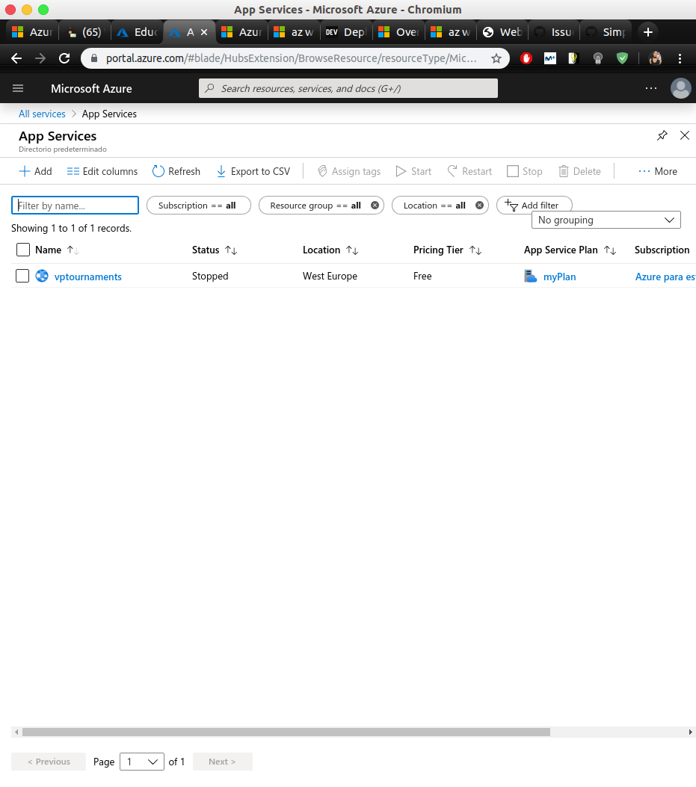
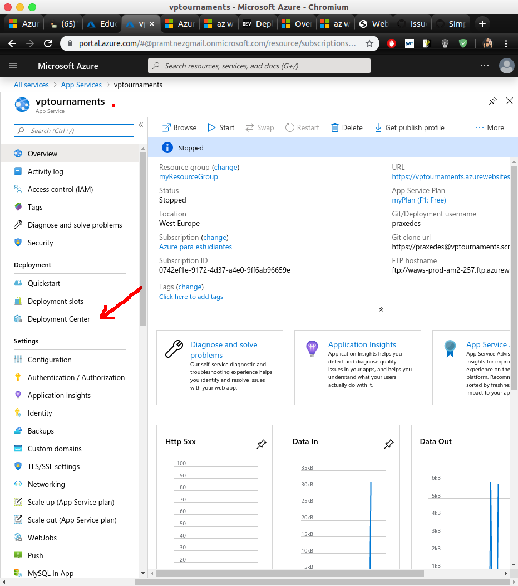
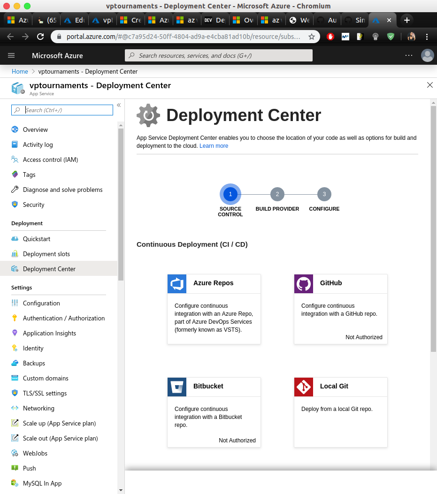
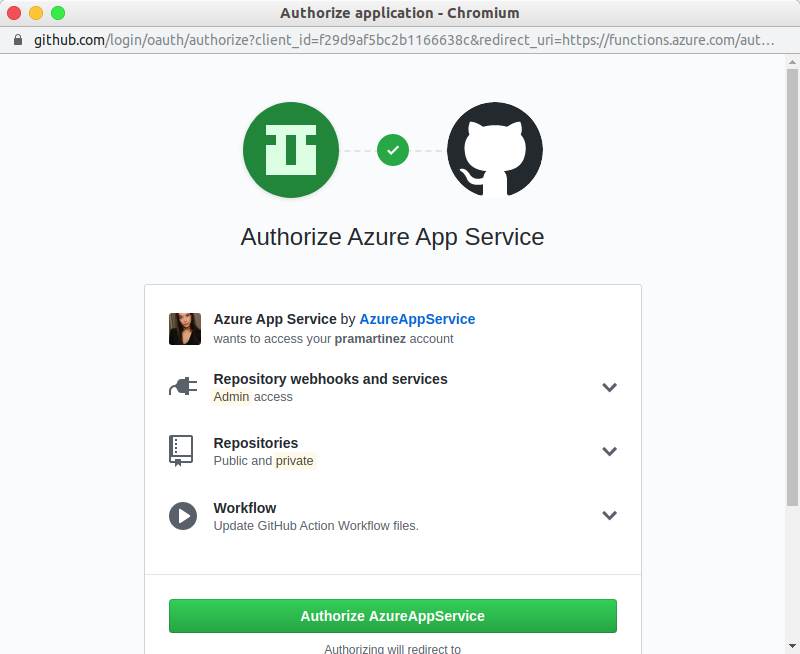
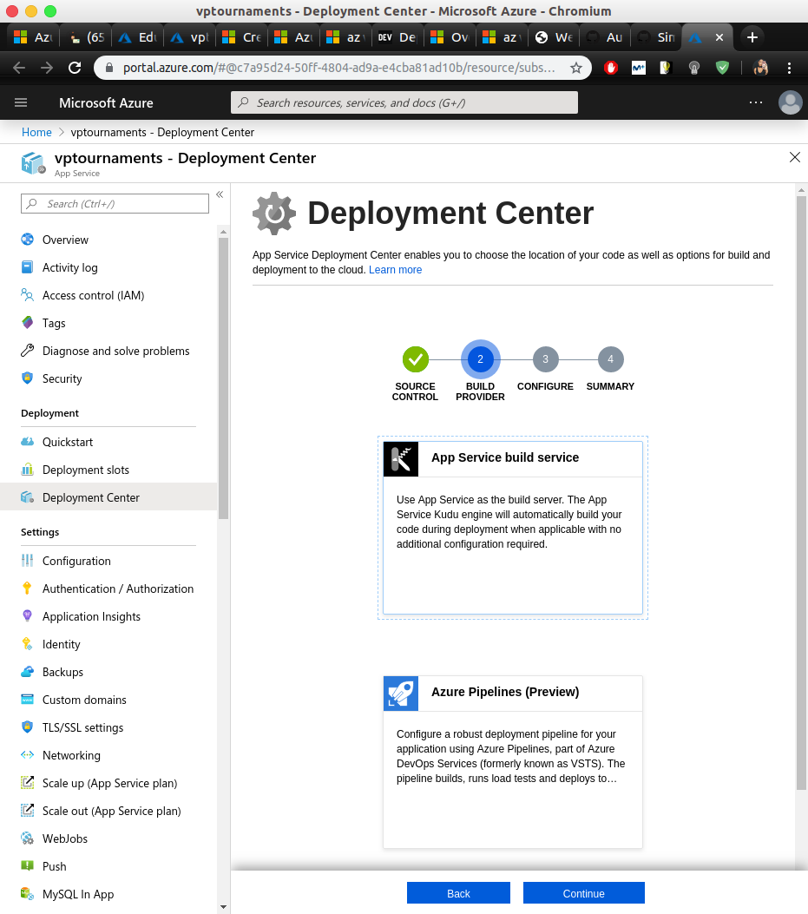
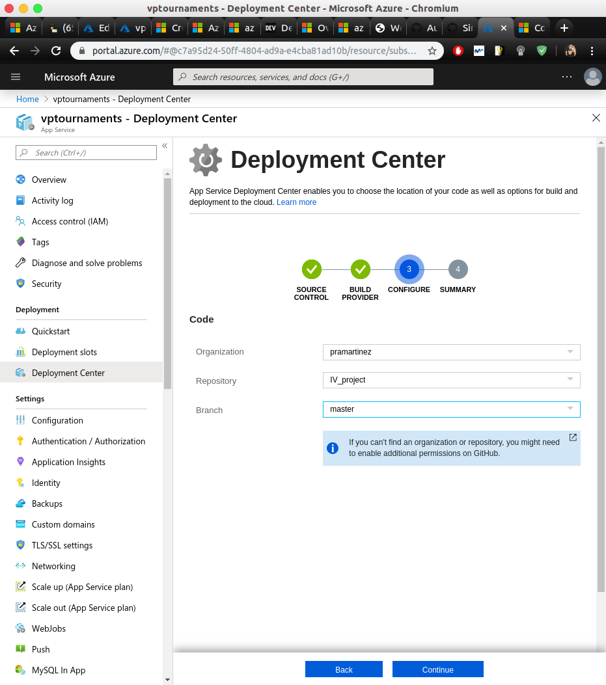
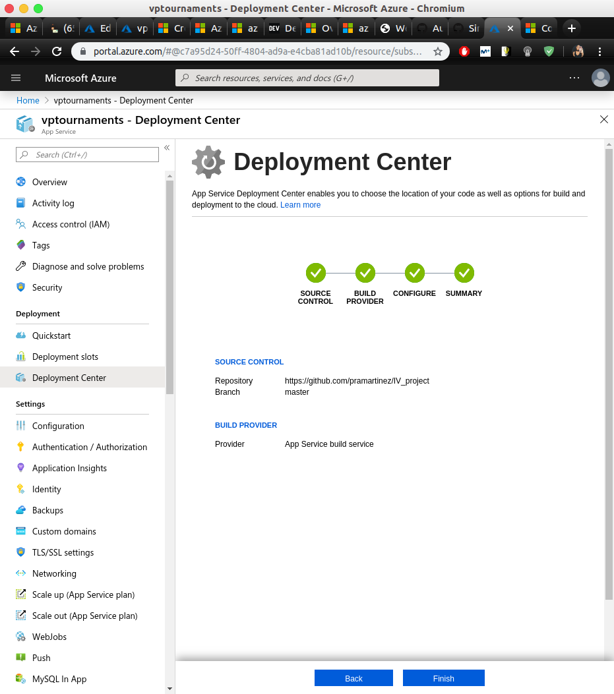

# Azure Continuous Deployment

Como lo que nos interesa es no tener que estar trabajando con dos repositorios a la vez, es decir, el remoto de Azure y el nuestro propio, vamos a recurrir a la configuración que se ofrece en la web de Azure para habilitar el despliegue automático con GitHub. A continuación se muestran los pasos seguidos:

#### Accedemos a los ajustes de los servicios de aplicaciones y seleccionamos nuestra aplicación:   



####  Vamos a ```Deployment Center```:



#### Seleccionamos GitHub:



#### Autorizamos la aplicación en GitHub:



#### Seleccionamos App Service build service:



#### Especificamos los datos del repositorio:



#### Comprobamos que se ha realizado correctamente:




