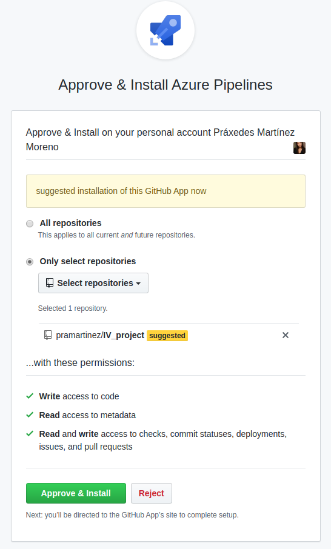
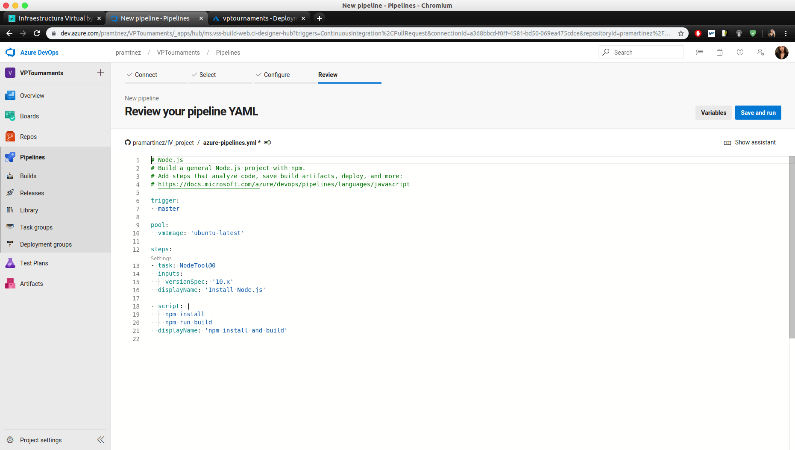
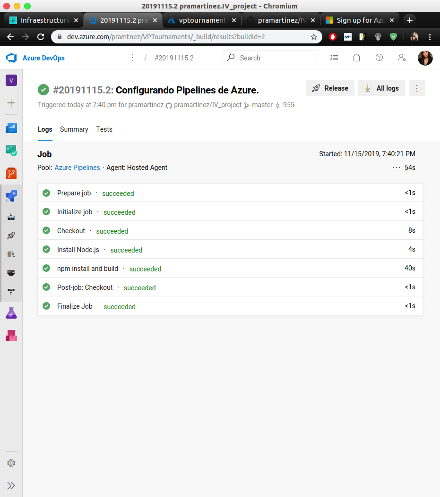

# Azure Continuous Deployment

___________________________________

> Índice

<!--ts-->
- [Azure Continuous Deployment](#azure-continuous-deployment)
- [Azure Pipelines](#azure-pipelines)
  - [**Creamos un archivo de configuración de Azure Pipelines: ```azure-pipelines.yml```**](#creamos-un-archivo-de-configuraci%c3%b3n-de-azure-pipelines-azure-pipelinesyml)
<!--te-->

__________________________________________


Como lo que nos interesa es no tener que estar trabajando con dos repositorios a la vez, es decir, el remoto de Azure y el nuestro propio, vamos a recurrir a la configuración que se ofrece en la web de Azure (porque por línea de comandos no era posible) para habilitar el despliegue automático con GitHub. Además, vamos a realizarlo pero teniendo en cuenta que hay que llevar a cabo un testeo de lo que se sube al repositorio (que al fin y al cabo es el código que se despliega), es por esto por lo que recurrimos a **Azure Pipelines**. Más adelante se habla de esta herramienta pero por el momento se muestran los pasos seguidos para el despliegue continuo con GitHub:

**Accedemos a los ajustes de los servicios de aplicaciones y seleccionamos nuestra aplicación:**

En mi caso es **vptournaments**, que es la única que existe.


**Vamos a** ```Deployment Center```:

Que se encuentra en el menú a la izquierda, en el apartado de **Deployment**.


**Seleccionamos GitHub:**

Queremos conectar nuestra apliación con su repositorio de git para realizar el despliegue automático sin tener que hacerlo de forma manual y menos aún teniendo en cuenta que, en mi caso, he desplegado la aplicación tanto en Azure como en Heroku y tendría que estar subiendo los cambios a los tres respositorios.


**Autorizamos la aplicación en GitHub:**

No podremos continuar habilitando el despliegue automático si antes no autorizamos la aplicación en GitHub.


**Seleccionamos App Service build service:**

Seleccionamos la primera opción (**App Service build service**) pero no descartamos la segunda, pues la retomamos más tarde (**Azure Pipelines**).


**Especificamos los datos del repositorio:**


**Comprobamos que se ha realizado correctamente:**

Ya tendríamos habilitado el despliegue automático, ahora con un simple ```git push``` nos evitamos hacer también ```git push azure master```.


# Azure Pipelines

<a name="pipelines"></a>

Para, además de realizar un despliegue continuo, hacer una integración continua, recurrimos a Azure Pipelines. Con esta herramienta podemos construir y testear el códido del proyecto de forma automática. Para configurarla simplemente seguimos los siguientes pasos:

**Tenemos que registrarnos en Azure DevOps Services: iniciamos sesión con Github, por lo que tenemos que permitir el acceso:**



## **Creamos un archivo de configuración de Azure Pipelines: [```azure-pipelines.yml```](https://pramartinez.github.io/IV_project/azure_pipelines_doc)**

Aquí se puede ver la [documentación de ```azure-pipelines.yml```](https://pramartinez.github.io/IV_project/azure_pipelines_doc).

En la plataforma es especialmente sencillo porque te invita a seguir unos pasos que implican la creación de este archivo de configuración mencionado el cuál ya tiene alguna de las pautas necesarias incluidas. Nosotros tenemos que indicar los comandos de construcción de nuestro proyecto, en vez de usar ```npm run start``` indicamos ```gulp start &```, además de ```gulp stop``` y ```gulp test```.



**Hacemos un commit al repositorio del proyecto con el archivo de configuración de Azure Pipelines y ya se comenzaría a hacer la construcción y el testeo:**

