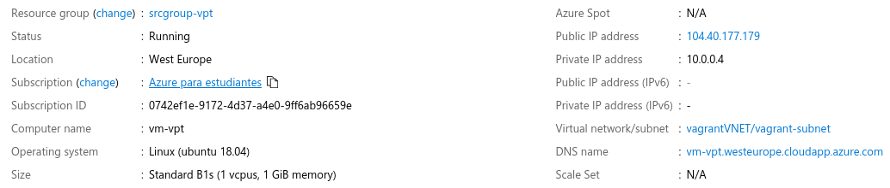

# Despliegue final del microservicio

___________________________________

> Índice

<!--ts-->
- [Despliegue final del microservicio](#despliegue-final-del-microservicio)
    - [Primero creamos el grupo de recursos que emplearemos para crear la máquina virtual en cuestión:](#primero-creamos-el-grupo-de-recursos-que-emplearemos-para-crear-la-m%c3%a1quina-virtual-en-cuesti%c3%b3n)
    - [A continuación, creamos una asignación de rol según nuestra subscripción:](#a-continuaci%c3%b3n-creamos-una-asignaci%c3%b3n-de-rol-seg%c3%ban-nuestra-subscripci%c3%b3n)
    - [Creamos Vagrantfile:](#creamos-vagrantfile)
    - [Levantamos la máquina sin aprovisionarla recurriendo a *Vagrant* (luego usaremos Gulp) para probar que todo es correcto:](#levantamos-la-m%c3%a1quina-sin-aprovisionarla-recurriendo-a-vagrant-luego-usaremos-gulp-para-probar-que-todo-es-correcto)
    - [Probamos a contectarnos con *ssh* para probar si se establece la conexión de forma correcta:](#probamos-a-contectarnos-con-ssh-para-probar-si-se-establece-la-conexi%c3%b3n-de-forma-correcta)
    - [Aprovisionamos la mv con vagrant:](#aprovisionamos-la-mv-con-vagrant)
    - [Tomamos la IP pública de nuestra máquina virtual:](#tomamos-la-ip-p%c3%bablica-de-nuestra-m%c3%a1quina-virtual)
    - [Ya podemos conectarnos con el usuario creado y con la IP pública de la máquina que acabamos de consultar a través del puerto específico para el servicio *SSH*:](#ya-podemos-conectarnos-con-el-usuario-creado-y-con-la-ip-p%c3%bablica-de-la-m%c3%a1quina-que-acabamos-de-consultar-a-trav%c3%a9s-del-puerto-espec%c3%adfico-para-el-servicio-ssh)
    - [Añadimos una única regla a Gulp para realizar todo este proceso de una vez:](#a%c3%b1adimos-una-%c3%banica-regla-a-gulp-para-realizar-todo-este-proceso-de-una-vez)
<!--te-->

__________________________________________


El proceso que se ha seguido para poder llevar a cabo el despliegue final del microservicio en una máquina virtual desde cero ha sido el siguiente:

### Primero creamos el grupo de recursos que emplearemos para crear la máquina virtual en cuestión:

```bash
$ az group create -l westeurope -n srcgroup-vpt

{
  "id": "/subscriptions/*******/resourceGroups/srcgroup-vpt",
  "location": "westeurope",
  "managedBy": null,
  "name": "srcgroup-vpt",
  "properties": {
    "provisioningState": "Succeeded"
  },
  "tags": null,
  "type": "Microsoft.Resources/resourceGroups"

```

Hemos indicado la localización y el nombre deseados. Esta información la necesitamos para incluirla en el Vagrantfile y, entonces, levantar la máquina virtual. 

### A continuación, creamos una asignación de rol según nuestra subscripción:

```bash
$ az ad sp create-for-rbac

Creating a role assignment under the scope of "/subscriptions/********"
{
  "appId": "******",
  "displayName": "azure-cli-2020-01-10-11-07-46",
  "name": "http://azure-cli-2020-01-10-11-07-46",
  "password": "******",
  "tenant": "******"
}
```

Como vemos, una vez hecho esto se nos proporciona cierta información relevante que no se muestra por privacidad. Dichos datos tenemos que utilizarlos también en el Vagrantfile.

### Creamos Vagrantfile:

```ruby
Vagrant.configure("2") do |config|
  # Definimos la máquina virtual dándole un nombre
  config.vm.define "vptournaments-vm"

  # La máquina virtual va a ser desplegada en Azure
  config.vm.box = "azure"

  # Indicamos la siguiente URL de dummy box que nos va facilitar una base 
  # para la máquina que estamos levantando
  config.vm.box_url = 'https://github.com/msopentech/vagrant-azure/raw/master/dummy.box'

  # Indicamos dónde se encuentra la clave privada para conectarse a la máquina virtual
  config.ssh.private_key_path = "~/.ssh/id_rsa"

  # El provider es Azure
  config.vm.provider "azure" do |vm, override|
    # Indicamos la siguiente información para poder continuar con el levantamiento
    vm.tenant_id = ENV['AZURE_TENANT_ID']
    vm.client_id = ENV['AZURE_CLIENT_ID']
    vm.subscription_id = ENV['AZURE_SUBSCRIPTION_ID']
    vm.client_secret = ENV['AZURE_CLIENT_SECRET']

    # Nombre de la máquina virtual
    vm.vm_name = "vm-vpt"
    # Nombre del grupo de recursos creado previamente
    vm.resource_group_name= "srcgroup-vpt"
    # Imagen de la máquina virtual
    vm.vm_image_urn = "Canonical:UbuntuServer:18.04-LTS:latest"
    # Tamaño de la máquina virtual, es uno de los más básicos porque puede que otros 
    # no encajen con nuestra subscripción
    vm.vm_size = "Standard_B1s"
    # Puerto donde escucha el microservicio
    vm.tcp_endpoints = "3000"
    # Localización
    vm.location = 'westeurope'
  end

  # El aprovisionamiento se realiza con Ansible
  config.vm.provision "ansible" do |ansible|
    # Indicamos cuál es el playbook y dónde se encuentra
    ansible.playbook = "despliegue/AZplaybook.yml"
  end

  # Segundo playbook
  config.vm.provision "ansible" do |ansible|
    ansible.playbook = "despliegue/playbook_despliegue.yml"
  end
end

```

### Levantamos la máquina sin aprovisionarla recurriendo a *Vagrant* (luego usaremos Gulp) para probar que todo es correcto:

```bash
$ vagrant up --no-provision

Bringing machine 'vptournaments-vm' up with 'azure' provider...
==> vptournaments-vm: Launching an instance with the following settings...
==> vptournaments-vm:  -- Management Endpoint: https://management.azure.com
==> vptournaments-vm:  -- Subscription Id: 0742ef1e-9172-4d37-a4e0-9ff6ab96659e
==> vptournaments-vm:  -- Resource Group Name: srcgroup-vpt
==> vptournaments-vm:  -- Location: westeurope
==> vptournaments-vm:  -- Admin Username: vagrant
==> vptournaments-vm:  -- VM Name: vm-vpt
==> vptournaments-vm:  -- VM Storage Account Type: Premium_LRS
==> vptournaments-vm:  -- VM Size: Standard_B1s
==> vptournaments-vm:  -- Image URN: Canonical:UbuntuServer:18.04-LTS:latest
==> vptournaments-vm:  -- TCP Endpoints: 3000
==> vptournaments-vm:  -- DNS Label Prefix: vm-vpt
==> vptournaments-vm:  -- Create or Update of Resource Group: srcgroup-vpt
==> vptournaments-vm:  -- Starting deployment
==> vptournaments-vm:  -- Finished deploying
==> vptournaments-vm: Waiting for SSH to become available...
==> vptournaments-vm: Machine is booted and ready for use!
==> vptournaments-vm: Rsyncing folder: /home/praxedes/Documents/ETSIIT/cuarto_curso/IV/IV_project/ => /vagrant
==> vptournaments-vm: Machine not provisioned because `--no-provision` is specified.
```

Vemos que el levantamiento ha sido satisfactorio, por tanto, ya podríamos proceder a aprovisionar la máquina virtual.

### Probamos a contectarnos con *ssh* para probar si se establece la conexión de forma correcta:

```bash
$ vagrant ssh

Welcome to Ubuntu 18.04.3 LTS (GNU/Linux 5.0.0-1027-azure x86_64)

 * Documentation:  https://help.ubuntu.com
 * Management:     https://landscape.canonical.com
 * Support:        https://ubuntu.com/advantage

  System information as of Fri Jan 10 11:21:13 UTC 2020

  System load:  0.33              Processes:           115
  Usage of /:   6.8% of 28.90GB   Users logged in:     0
  Memory usage: 40%               IP address for eth0: 10.0.0.4
  Swap usage:   0%


0 packages can be updated.
0 updates are security updates.


vagrant@vpt:~$ 
```

Podemos comprobar que ha sido satisfactoria la prueba, ahora sí que podemos pasar a aprovisionarla. 

### Aprovisionamos la mv con vagrant:

Más adelante se creará una nueva tarea para que podamos realizar todo este proceso con Gulp.

```bash
$ vagrant provision

==> vptournaments-vm: Running provisioner: ansible...
Vagrant has automatically selected the compatibility mode '2.0'
according to the Ansible version installed (2.9.2).

Alternatively, the compatibility mode can be specified in your Vagrantfile:
https://www.vagrantup.com/docs/provisioning/ansible_common.html#compatibility_mode

    vptournaments-vm: Running ansible-playbook...

PLAY [all] *********************************************************************

TASK [Gathering Facts] *********************************************************
ok: [vptournaments-vm]

TASK [Update apt package list] *************************************************
[WARNING]: Updating cache and auto-installing missing dependency: python-apt

changed: [vptournaments-vm]

TASK [Install Node.js] *********************************************************
ok: [vptournaments-vm]

TASK [Install git] *************************************************************
ok: [vptournaments-vm]

TASK [Install npm] *************************************************************
ok: [vptournaments-vm]

TASK [Create user] *************************************************************
ok: [vptournaments-vm]

TASK [Add public key for 'azure' user] *****************************************
ok: [vptournaments-vm]

TASK [Clone GitHub repository] *************************************************
changed: [vptournaments-vm]

TASK [Install packages based on package.json] **********************************
ok: [vptournaments-vm]

TASK [Globally install gulp] ***************************************************
ok: [vptournaments-vm]

PLAY RECAP *********************************************************************
vptournaments-vm           : ok=10   changed=2    unreachable=0    failed=0    skipped=0    rescued=0    ignored=0   

==> vptournaments-vm: Running provisioner: ansible...
Vagrant has automatically selected the compatibility mode '2.0'
according to the Ansible version installed (2.9.2).

Alternatively, the compatibility mode can be specified in your Vagrantfile:
https://www.vagrantup.com/docs/provisioning/ansible_common.html#compatibility_mode

    vptournaments-vm: Running ansible-playbook...

PLAY [all] *********************************************************************

TASK [Gathering Facts] *********************************************************
ok: [vptournaments-vm]

TASK [Run gulp start] **********************************************************
changed: [vptournaments-vm]

PLAY RECAP *********************************************************************
vptournaments-vm           : ok=2    changed=1    unreachable=0    failed=0    skipped=0    rescued=0    ignored=0         
```

El aprovisionamiento también ha sido satisfactorio. Como vemos hay muchos casos en los que se indica ```ok: [vptournaments-vm]```, esto es debido a que la máquina ya se había aprovisionado de ello porque no es la primera vez que lo he ejecutado. Sin embargo, cuando se indica ```changed: [vptournaments-vm]```, significa que se ha producido un cambio en la máquina virtual, es decir, que no se había realizado esa tarea aún o que se ha modificado. 

Veamos cuáles han sido los *playbooks* de Ansible empleados:

```yml
---
- hosts: all
  become: yes
  tasks:
    # Actualizamos los packetes de apt
    - name: Update apt package list
      apt:
        update_cache: yes
        
    # Instalamos el lenguaje del proyecto
    - name: Install Node.js
      apt: name=nodejs state=present
    
    # Instalamos git, luego lo necesitaremos
    - name: Install git
      apt: name=git state=present
    
    # Instalamos npm
    - name: Install npm
      apt: name=npm state=present

    # Creamos un usuario llamado 'azure' 
    - name: Create user
      user:
        name: azure
        state: present
        shell: /bin/bash
        system: no       
        createhome: yes  
        home: /home/azure
        
    # Añadimos la clave pública para poder acceder mediante ssh utilizando el usuario que acabamos de crear y la IP de la máquina virtual
    - name: Add public key for 'azure' user
      authorized_key:
        user: azure
        state: present
        key: "{{ lookup('file', '~/.ssh/id_rsa.pub') }}"
            
    # Clonamos el repositorio del proyecto
    - name: Clone GitHub repository
      git:
        repo: 'https://github.com/pramartinez/IV_project.git'
        dest: /home/azure/vptournaments 
      
    # Instalamos las dependencias indicadas en package.json del proyecto
    - name: Install packages based on package.json
      npm:
        path: /home/azure/vptournaments
        state: present
      
    # Instalamos Gulp de forma global
    - name: Globally install gulp
      npm:
        name: gulp
        global: yes
```

Y un segundo playbook para el despliegue:

```yml
---
- hosts: all
  become: yes
  tasks:
    # Despliegue recurriendo a Gulp
    - name: Run gulp start
      shell: gulp start &
      args:
        chdir: /home/azure/vptournaments
```        

### Tomamos la IP pública de nuestra máquina virtual: 

Yo he accedido al portal de Azure para comprobar que todo se había creado correctamente y que se encontraba entre mis máquinas virtuales levantadas. En la siguiente imagen observamos la información de la actual:



### Ya podemos conectarnos con el usuario creado y con la IP pública de la máquina que acabamos de consultar a través del puerto específico para el servicio *SSH*:

```bash
$ ssh azure@104.40.177.179 -p 22

Welcome to Ubuntu 18.04.3 LTS (GNU/Linux 5.0.0-1027-azure x86_64)

 * Documentation:  https://help.ubuntu.com
 * Management:     https://landscape.canonical.com
 * Support:        https://ubuntu.com/advantage

  System information as of Fri Jan 10 11:50:32 UTC 2020

  System load:  0.0               Processes:           107
  Usage of /:   8.3% of 28.90GB   Users logged in:     0
  Memory usage: 38%               IP address for eth0: 10.0.0.4
  Swap usage:   0%


19 packages can be updated.
16 updates are security updates.


Last login: Fri Jan 10 11:50:21 2020 from 213.194.177.167
azure@vpt:~$ 
```

Vemos que todo es correcto y que la conexión se establece como es debido.

### Añadimos una única regla a Gulp para realizar todo este proceso de una vez:

```js
// Tarea para levantar, aprovisionar y desplegar 
gulp.task('fullup', function(done) {
  exec( 'vagrant up', function(err, stdout, stderr) {
    console.log(stdout);
    console.log(stderr);
    done(err);
  });
});
```

Con esta regla estaríamos levantando la máquina, aprovisionándola y, además, desplegando el microservicio. Esto es así porque el comando ```vagrant up``` levanta la máquina virtual recurriendo al *Vagrantfile* que hemos creado previamente y, a continuación, la aprovisiona según lo indicado en los *playbooks* de Ansible. 

