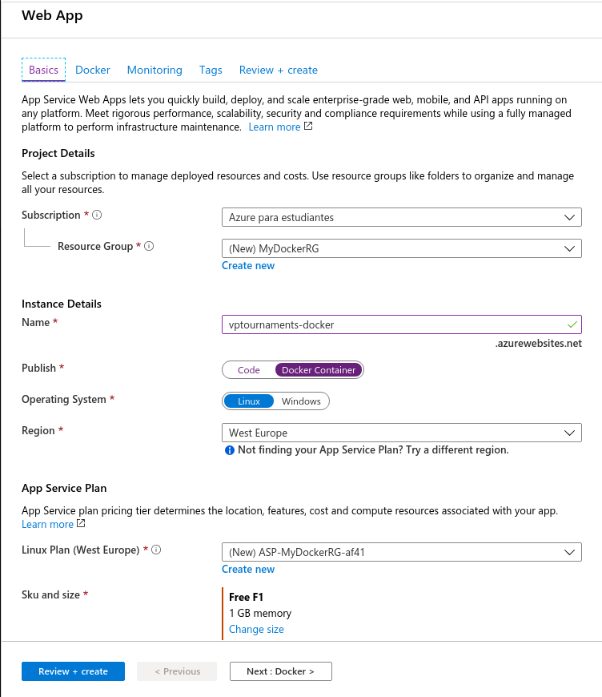
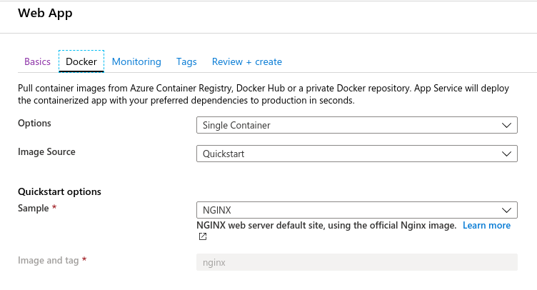
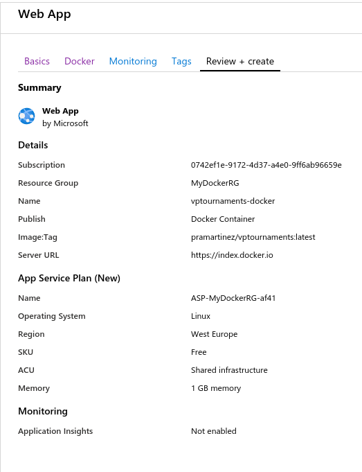
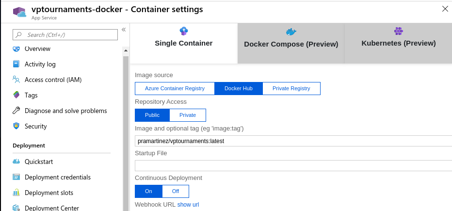
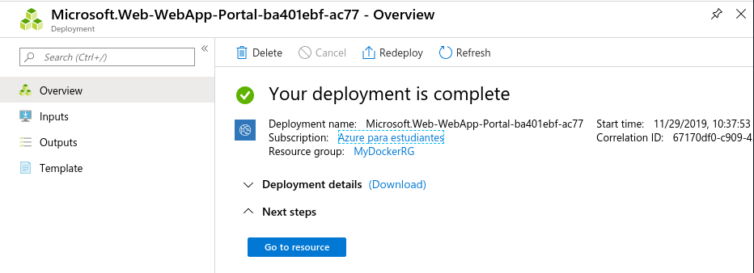

# Deploy Docker container on Azure

La idea es que nuestra imagen de Docker de nuestro microservicio esté disponible en la plataforma de Azure. Para poder conseguir tenemos que crear una nueva aplicación e indicar que queremos que se despliegue desde Docker Hub. Lo que ocurre es que esto tenemos que hacerlo a través del portal de Azure, así podremos especificar los datos sobre el contenedor de Docker. 

- Primero tenemos que acceder al portal de Azure y crear una nueva aplicación rellenando los campos correspondientes: 

Tenemos que indicar que se publica desde un contenedorde Docker. Además, es importante crear otro plan de servicio de aplicaciones porque si no, nos da un fallo.

- Luego indicamos la configuración de Docker rellenando los siguientes apartados:  

- Cuando todo esté listo le pulsamos a revisar y crear y veríamos que se comienza a realizar el despliegue. 

  

- Es importante comprobar en la configuración del contenedor que está marcado el despliegue continuo:  

- Ya estaría realizado el despliegue completo:  

  

- Ahora podemos acceder a la [URL](https://vptournaments-docker.azurewebsites.net/).  
