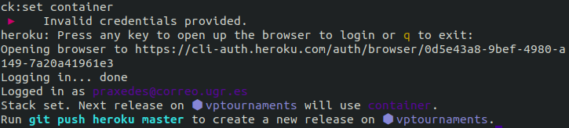

# Docker image deployment on Heroku

Veamos el procedimiento seguido para el despliegue en Heroku de una imagen de Docker de nuestro microservicio. 

- Primero tenemos que proceder a crear un archivo **```heroku.yml```**, donde referenciaremos al Dockerfile que ya construimos previamente. Lo que hacemos ahora es incluir lo siguiente en este nuevo archivo:  

  ```bash
  build:
    docker:
      web: Dockerfile
  ```

Así estamos especificando que se habrá de construir una imagen de Docker para el proceso ```web```. Además podríamos usar un subapartado ```run``` si quisiéramos indicar un comando de arranque específico para este caso, pero como queremos que se ejecute el mismo que indicamos en el Dockerfile en su momento, no es necesario.  

- Ahora tenemos que hacer un commit al repositorio para poder incluir este nuevo archivo. Justo después vamos a establecer la pila de nuestra aplicación en el contenedor:

  ```bash
  $ heroku stack:set container
  ```
- Al ejecutar este comando nos pide que hagamos login redireccionándonos a la web:

  

- Una vez realizado el log in, ya nos indica que podemos hacer push a nuestro repositorio.

  

- Ahora nuestra aplicación se construirá y podremos acceder a ella en esta [URL](https://vptournaments.herokuapp.com/). 


