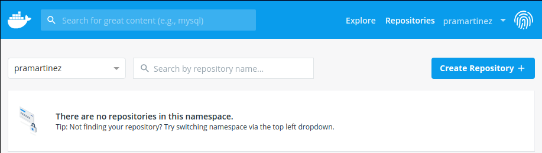
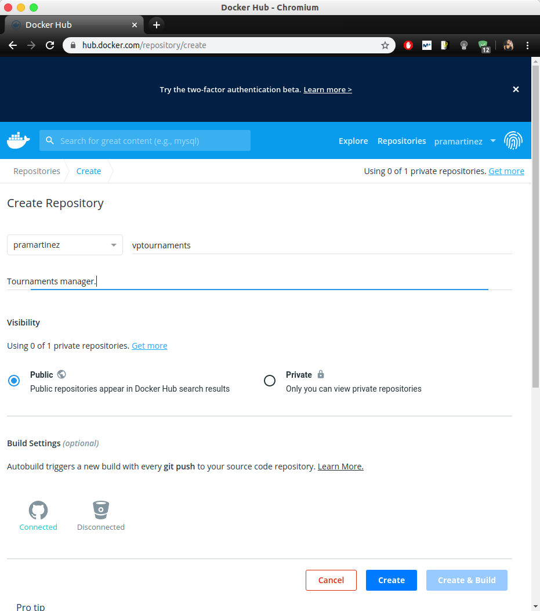
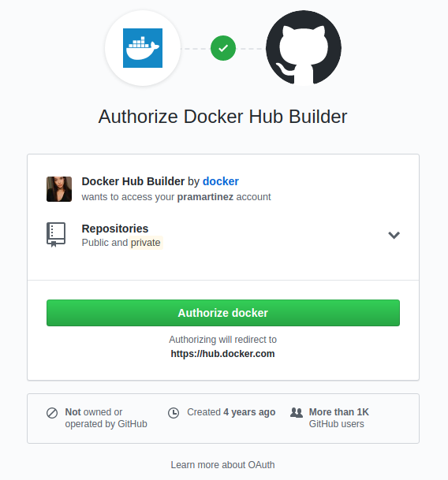
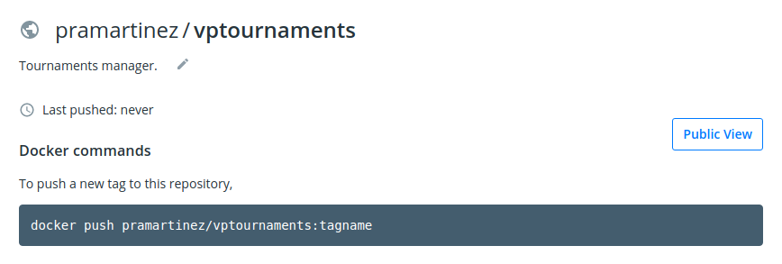
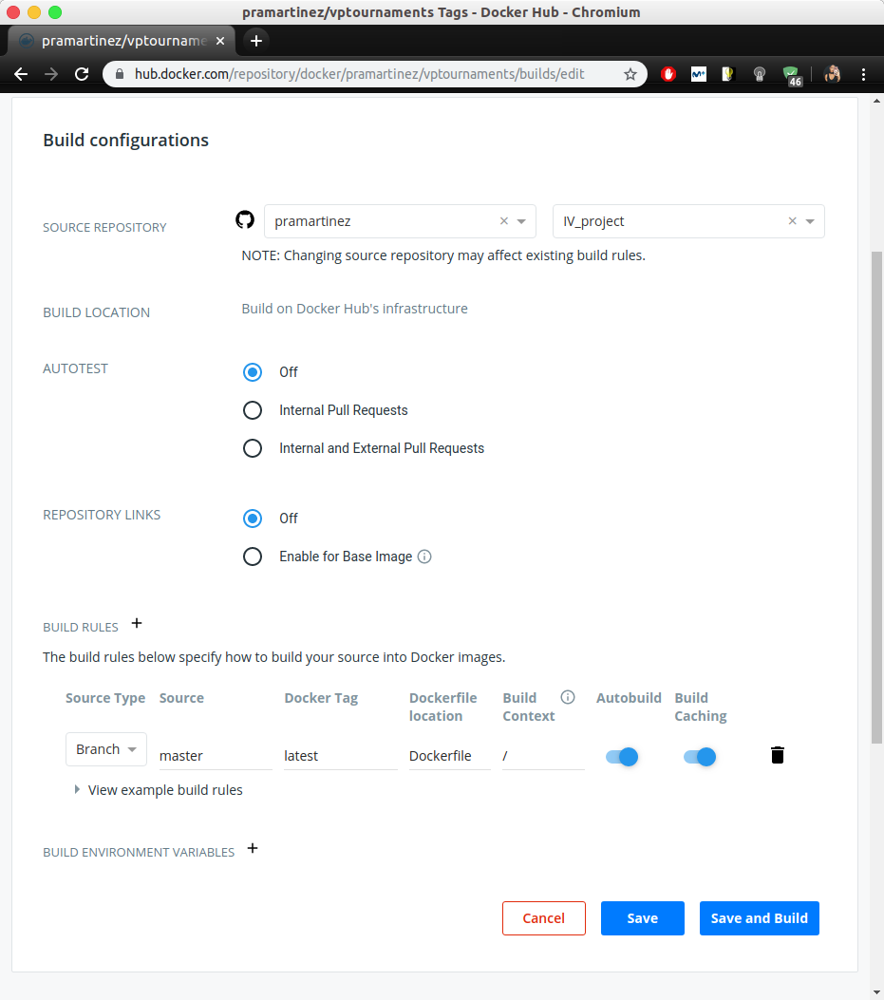
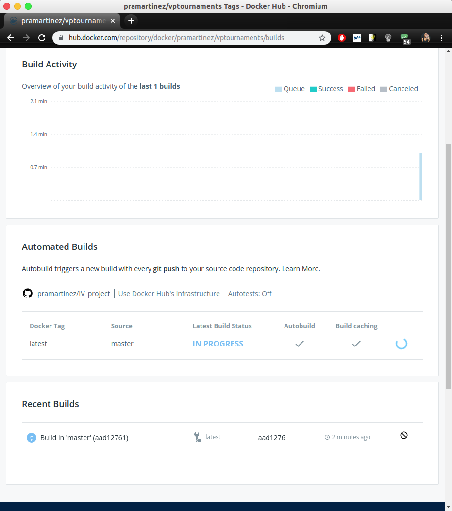
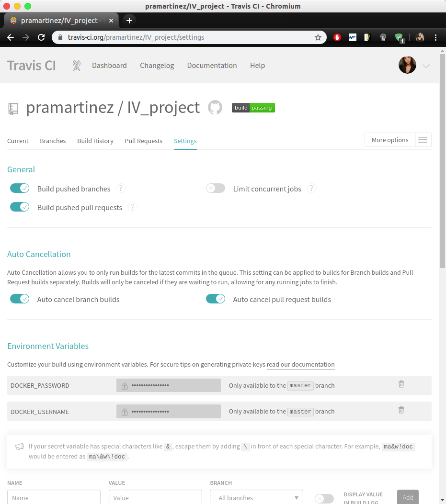

# Docker y Docker Hub

___________________________________

> Índice

<!--ts-->
- [Creación del *Dockerfile* y del *.dockerignore*](#dockerfile)
- [Despliegue de imagen en Docker Hub](#dockerhub)
- [Integración continua](#ci)
  - [docker_push](#dp)
- [Docker pull image](#dpi)
<!--te-->

__________________________________________

A continuación se explica el procedimiento seguido para usar Docker en nuestro microservicio. La finalidad de usar esta herramienta es la de poder desplegar y arrancar nuestra aplicación de forma más sencilla usando contenedores. 

Para comenzar, lo que tenemos que hacer es darnos de alta en la web de Docker Hub, pues lo necesitaremos para luego poder realizar el despliegue. Una vez hecho esto, vamos a crear un ```Dockerfile``` y un ```.dockerignore```.

## Creación del *Dockerfile* y del *.dockerignore*

<a name="dockerfile"></a>

- En dockerfile incluimos las siguientes líneas:  
	- Primero especificamos la versión de node con la que vamos a trabajar, concretamente usaremos la última versión de node soportada, que es la 10:  
		```bash
		FROM node:10
		```  
	
	- Ahora creamos el directorio de trabajo para la aplicación:  
		```bash
		# Create app directory
		WORKDIR /vptournaments
		```
	
	- Lo que tenemos que hacer a continuación es añadir aquellos archivos y/o directorios imprescindibles para nuestro microservicio:  
		```bash
		# Bundle app source
		COPY app ./app
		COPY bin ./bin
		COPY routes ./routes
		COPY *.js ./
		COPY Procfile ./
		COPY *.yml ./
		```

	- Entonces ya podemos indicar la instalación de dependencias. Para esto, tenemos que copiar el ```package.json``` y el ```package-lock.json``` e indicar que la instalación de dependencias se realiza con ```npm install```:  
		```bash
		# Install dependencies
		COPY package*.json ./
		RUN npm install
		```

	- Como nuestra herramienta de construcción es ```Gulp```, tenemos que instalarla globalmente para utilizarla en el despliege:	
		```bash
		# Install buildtool
		RUN npm install -g gulp
		```

	- Indicamos entonces el puerto, usamos la variable de entorno ```PORT``` y, luego, ```EXPOSE```. Esta última instrucción sirve para informar a Docker de que el contenedor escucha en un puerto de red concreto durante la ejecución:
		```bash
		ENV PORT 3000
		EXPOSE 3000
		```

	- Por último, especificamos el comando de despliegue de nuestro microservicio:
		```bash
		CMD [ "gulp", "start" ]
		```

- Ahora creamos un ```.dockerignore``` file. La idea es evitar que se copien módulos locales y logs en la imagen de la aplicación, así evitamos tener archivos innecesarios o que se sobreescriban módulos instalados en la imagen. El contenido del ```.dockerignore``` queda así:   
	```bash  
	node_modules
	npm-debug.log
	```   

## Despliegue de imagen en Docker Hub

<a name="dockerhub"></a>

Ahora lo que queremos es desplegar una imagen de nuestro microservicio en Docker Hub. Como se indica en la propia web de este, Docker Hub es el mayor repositorio del mundo de contendores de imágenes con una gran variedad de fuentes de contenido. Además, los usuarios de esta plataforma tienen acceso a repositorios gratuitos para así almacenar o incluso compartir sus imágenes. Como nosotros también queremos ser parte de esta comunidad de usuarios, procedemos con los pasos que se expondrán a cotinuación para ello. Además, es importante realizar todo esto porque luego recurriremos a Docker Hub para poder desplegar una imagen de nuestro contenedor en Azure.

- En primer lugar tenemos que tener una cuenta de ```Docker Hub``` como ya indicábamos anteriormente. Por tanto, iniciamos sesión y accedemos al apartado de ```Repositories```:  
 


- A continuación, tenemos que crear un repositorio de ```Docker Hub```, para ello, pulsamos a ```Create Repository +```:  

	 

- Tenemos que indicar el nombre del mismo y que es público:

	


- Además, conectamos nuestra cuenta de GitHub:  
  
	 

- Una vez creado, vemos lo siguiente en nuestro perfil de Docker Hub:  

	


Hasta ahora hemos conseguido crear el repositorio donde desplegaremos la imagen de nuestro microservicio. Entonces, lo que tenemos que hacer a continuación es acceder a la configuración de la construcción, es decir, a ```Build configurations```. Aquí, en el apartado de ```BUILD RULES``` especificamos cómo se va a construir nuestro recurso. Para ello, especificamos la rama (```master```), la etiqueta de Docker (```latest```), la localización del Dockerfile y, por último y muy importante, tenemos que marcar que se lleve acabo un ```Autobuild```. De esta forma conseguimos que, cada vez que hagamos ```push``` en nuestro repositorio del microservicio, se realice el despliegue de la imagen en Docker Hub:




Entonces si pulsamos en ```Save and Build```, se procederá al despliegue:




## Integración continua

<a name="ci"></a>

Hemos conseguido realizar el despliegue, pero de la forma en que lo hemos hecho, no nos aseguramos de que lo que estamos desplegando es correcto. Para paliar esto, tenemos que recurrir a la integración continua. Concretamente, lo que hacemos es:

- Primero modificamos nuestro archivo de configuración de travis, ```travis.yml```, indicando el siguiente nuevo apartado:  
  
	```bash
	deploy:
	provider: script
	script: bash docker_push
	on:
		branch: master
	```  
	Es decir, indicamos un apartado ```deploy``` para que se pueda testear este también. Dicho apartado contiene el comando que se ha de ejecutar para poder realizarlo. 
	
	### docker_push
	
	<a name="dp"></a>


	Dicho comando se basa en la ejecución de un script (```docker_push```) que contiene el siguiente código:  

	- Primero se hace un login en docker recurriendo a nuestras credenciales.
		```bash
		docker login -u $DOCKER_USERNAME -p $DOCKER_PASSWORD
		```  
	- En segundo lugar, se construye una imagen de nuestra aplicación:  
		```bash
		docker build -t pramartinez/vptournaments .
		```  
	- A continuación, se crea un tag para esta:  
		```bash
		docker tag vptournaments pramartinez/vptournaments:latest
		```  
	- Por último, se hace un push al repositorio de Docker Hub:  
		```bash
		docker push pramartinez/vptournaments
		```

Como podemos ver, en el primer paso, se ha recurrido a las credenciales del usuario pero mediante variables de entorno. Dichas variables tenemos que definirlas en la plataforma de Travis CI. Para esto tenemos que acceder a las opciones sobre ```Enviroment Variables``` e indicamos el nombre de dichas variables y su valor secreto:  




Ahora ya tendríamos realizado correctamente nuestro despliegue en Docker Hub. Cada vez que hagamos ```push``` localmente en nuestro repositorio, se desplegará una imagen de la aplicación en Docker Hub **pasando previamente los tests de integración continua de Travis CI.**


## Docker pull image

<a name="dpi"></a>


Si queremos ahora descargar la imagen de Docker Hub, tenemos que recurrir al comando para obtener la última versión:

```bash
$ sudo docker pull pramartinez/vptournaments
```
Si yo, por ejemplo, lo ejecuto ocurre lo siguiente:

```bash
Using default tag: latest
latest: Pulling from pramartinez/vptournaments
844c33c7e6ea: Already exists 
ada5d61ae65d: Already exists 
f8427fdf4292: Already exists 
f025bafc4ab8: Already exists 
7a9577c07934: Already exists 
9b4289f800f5: Already exists 
9b8b4aee1f5f: Already exists 
44594f2195cd: Already exists 
b0d47c2d812b: Already exists 
2600e4eb9f85: Pull complete 
9ca17106a2b0: Pull complete 
05358e23a1ca: Pull complete 
eecf76ae0a1c: Pull complete 
39f11b853b8f: Pull complete 
dfc4542ae618: Pull complete 
2f98ee6aebe3: Pull complete 
5c24cb7821c1: Pull complete 
723afb851ea3: Pull complete 
e2d860c10b89: Pull complete 
Digest: sha256:cb0049e98a5c05137b7d5799a80b3952433a66c2ab6ae46d62152ae99c4afa7b
Status: Downloaded newer image for pramartinez/vptournaments:latest
docker.io/pramartinez/vptournaments:latest
```