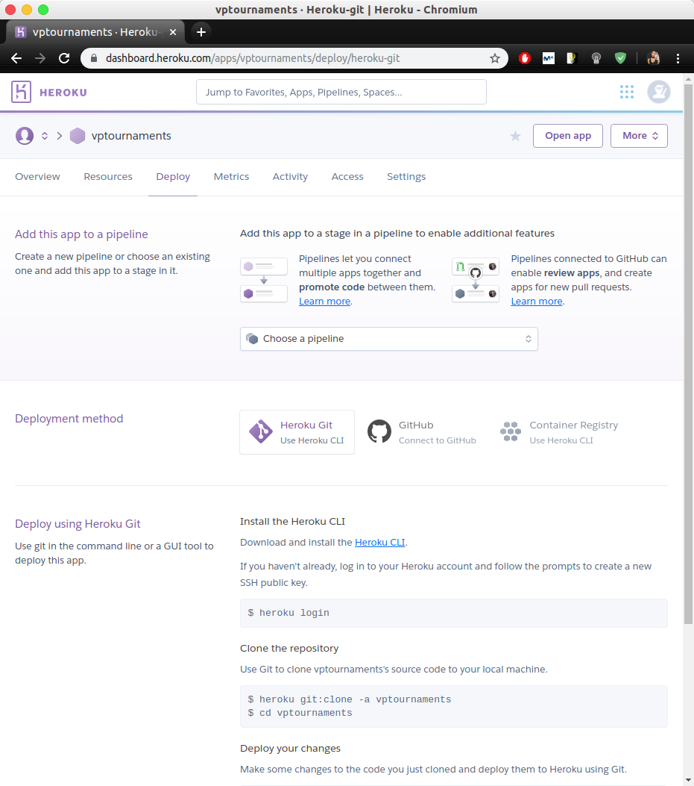
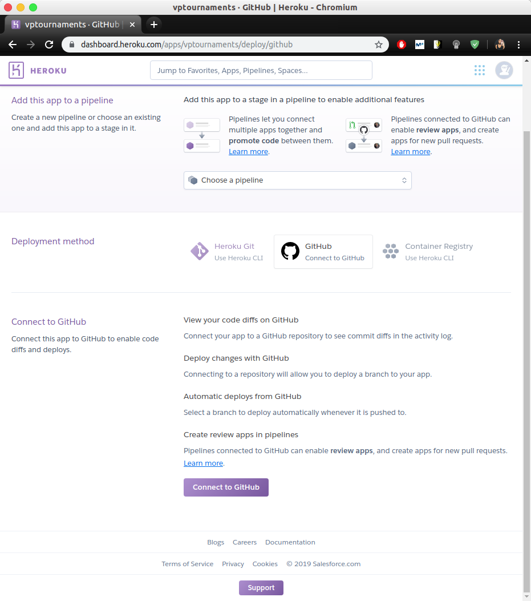
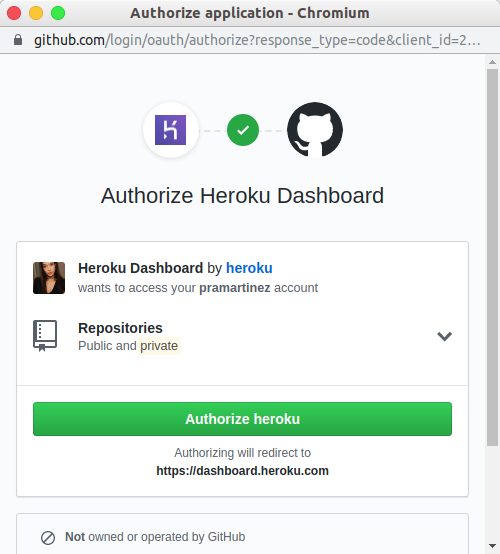
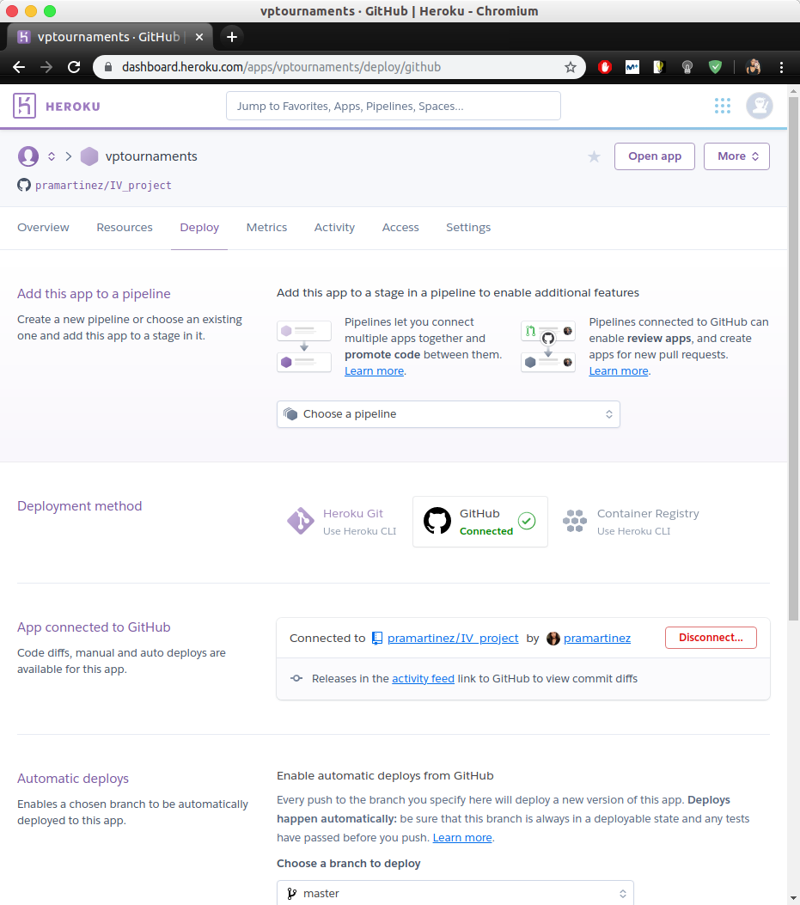
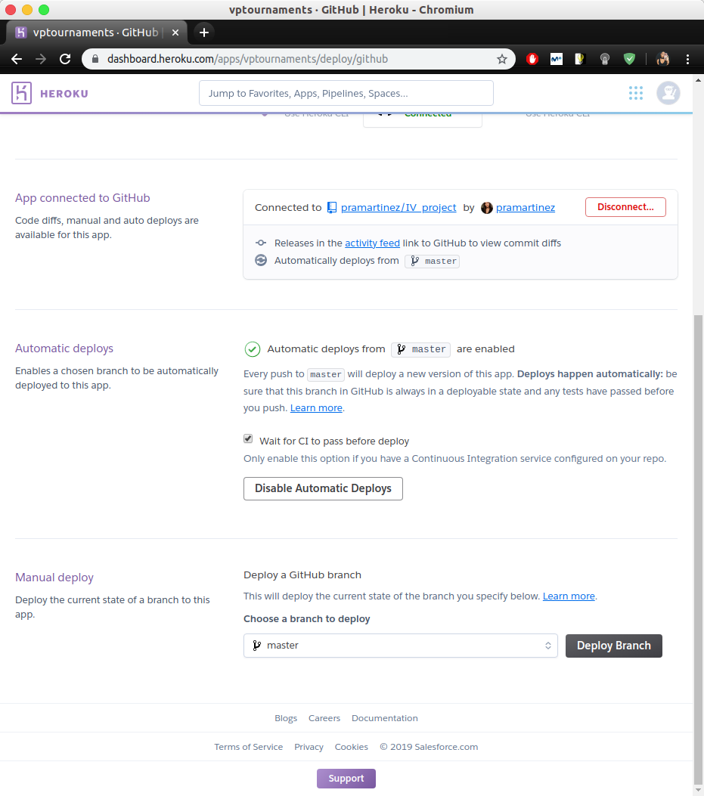

# Heroku Continuous Deployment

Como lo que nos interesa es no tener que estar trabajando con dos repositorios a la vez, es decir, el remoto de Heroku y el nuestro propio, vamos a recurrir a la configuración que se ofrece en la web de Heroku para habilitar el despliegue automático con GitHub. A continuación se muestran los pasos seguidos:

#### Accedemos a los ajustes, concretamente al apartado ```Deploy``` 



####  Vamos a ```Deployment method``` y conectamos con GitHub:



#### Autorizamos la aplicación en GitHub:



#### Ahora indicamos la aplicación que queremos conectar en ```App connected to GitHub```:



#### En ```Automatic deploys``` indicamos la rama concreta (master) y marcamos que se tengan que pasar los tests de integración continua antes del despliegue:



