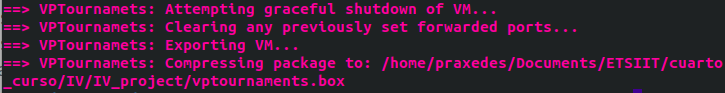

# Uso de vagrant para crear y levantar una MV

## Crear una máquina virtual con Vagrant

Para poder crear máquinas virtuales de forma automatizada, necesitamos crear un **Vagrantfile**. Este archivo se encarga de describir el tipo de máquinas que requerimos para nuestro proyecto y cómo configurarlas y provisionarlas. 

Los criterios para elegir correctamente una Vagrant Box son los siguientes: es bastante recomendable que el nombre de usuario sea conocido, como por ejemplo *ubuntu*, ya que es más fiable que uno desconocido. El número de descargas es muy importante, boxes descargadas en gran cantidad de veces tienden a ser examinadas con mayor frecuencia por miembros de la comunidad. También es importante comprobar la fecha de lanzamiento puesto que aquellas que se actualizan de forma periódica tendrán un software más al día. Por útlimo, otro detalle importate es la disponibilidad de la descarga, es decir, si es publicamente accesible. Podemos encontrar las Vagrant Boxes disponibles en el [este enlace](https://app.vagrantup.com/boxes/search?provider=virtualbox).

Teniendo en cuenta todos estos aspectos, he decidido utilizar la siguiente Vagrant Box: ```ubuntu/bionic```.

Veamos como se ha configurado el ***Vagrantfile*** con esta decisión y las próximas que tomaremos:

  1. En primer lugar tenemos que indicar las siguientes líneas que son las que necesitamos para poder empezar a hacer cualquier cosa:  
      ```javascript
      VAGRANTFILE_API_VERSION="2"

      Vagrant.configure(VAGRANTFILE_API_VERSION) do |config|
      ```
   

  2. Ahora tenemos que indicar la box de Vagrant elegida y cómo la denominaremos:  
      ```javascript
      config.vm.define "VPTournamets"
      config.vm.box = "ubuntu/bionic64"
      ```  
        En este ejemplo, vamos a crear una máquina virtual con Ubuntu basada en la LTS más reciente, esto lo he decidido así porque siempre es importante trabajar con una versión estable y más si esta se encuentra en su última actualización.
  
  3. Indicamos que no queremos que se actualice de forma automática, ya que nos interesará más hacerlo de forma manual cuando queramos hacerlo específicamente:
      ```javascript
      config.vm.box_check_update = false
      ```
   
  4. Indicamos el provider de la máquina virtual, que en este caso va a ser VirtualBox ya que es el que se usa por defecto y además es gratis en todas las plataformas. Indicamos la memoria que queremos que tenga y podríamos indicar otras características como, por ejemplo, el número de cpus y que no se emplee la interfaz gráfica.  
      ```javascript 
      config.vm.provider "virtualbox" do |vptournaments|
          vptournaments.memory = "1024"
          vptournaments.cpus=2
          vptournaments.gui = false
      end
      ```

  5. Ahora podemos indicar la herramienta de provisionamiento para nuestra máquina virtual de Vagrant. En nuestro caso hemos elegido Ansible. Tenemos que indicar el *playbook* indicado y previamente creado para la ocasión:  
      ```javascript
      config.vm.provision "ansible" do |ansible|
        ansible.playbook = "provision/myplaybook.yml"
      end
      ```

## Uso del gestor de tareas para levantamiento y provision

Se han incluido las siguientes dos nuevas tareas en el ```gulpfile.js```: 

  1. La siguiente tarea la empleamos para levantar la box de Vagrant, como vemos, se ha indicado que no se realice la provisión para poder hacerla mediante otra tarea, de forma independiente:
        ```javascript
        // Tarea para levantar la MV
        gulp.task('up', function(done) {
        exec( 'vagrant up --no-provision', function(err, stdout, stderr) {
            console.log(stdout);
            console.log(stderr);
            done(err);
        });
        });
        ```

  2. La tarea a continuación la podremos utilizar para provisionar la máquina virtual recurriendo a Ansible (lo hace Vagrant de forma interna):
        ```javascript
        // Tarea para provisionar la MV a través de vagrant
        gulp.task('provision', function(done) {
        exec( 'vagrant provision', function(err, stdout, stderr) {
            console.log(stdout);
            console.log(stderr);
            done(err);
        });
        });
        ```


# Subir imagen de la MV a Vagrant Cloud

Para esto, necesitamos ejecutar el siguiente comando en la línea de órdenes:

```javascript
$ vagrant package --output vptournaments.box
```

Y vemos que ocurre lo siguiente:



Y, a continuación, subirlo a la plataforma elegida. Como es obvio, tenemos que darnos de alta. Luego creamos una nueva box, indicamos la versión y el provider y subimos la imagen.

El enlace que se ha proporcionado para la máquina virtual de Vagrant es este: [praxedes/VPTournaments.](https://app.vagrantup.com/praxedes/boxes/VPTournaments)


