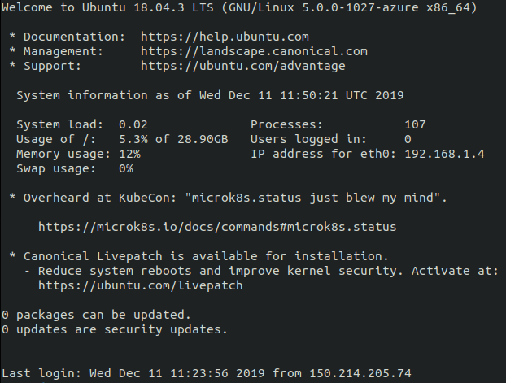

# Creación de máquinas virtuales

___________________________________

> Índice

<!--ts-->
- [Creación de máquinas virtuales](#creaci%c3%b3n-de-m%c3%a1quinas-virtuales)
  - [Creación de una máquina virtual con Azure](#creaci%c3%b3n-de-una-m%c3%a1quina-virtual-con-azure)
    - [Creamos recursos de red para dar soporte a la VM con acceso a Internet](#creamos-recursos-de-red-para-dar-soporte-a-la-vm-con-acceso-a-internet)
      - [Creamos un grupo de recursos](#creamos-un-grupo-de-recursos)
      - [Creamos una red virtual y una subred](#creamos-una-red-virtual-y-una-subred)
      - [Crear una dirección IP pública](#crear-una-direcci%c3%b3n-ip-p%c3%bablica)
      - [Creamos un grupo de seguridad de red](#creamos-un-grupo-de-seguridad-de-red)
      - [Definimos reglas que permiten o deniegan el tráfico específico](#definimos-reglas-que-permiten-o-deniegan-el-tr%c3%a1fico-espec%c3%adfico)
      - [Creamos un adaptador de red virtual](#creamos-un-adaptador-de-red-virtual)
      - [Creamos un conjunto de disponibilidad](#creamos-un-conjunto-de-disponibilidad)
    - [Creación de una máquina virtual](#creaci%c3%b3n-de-una-m%c3%a1quina-virtual)
      - [Exportar como plantilla](#exportar-como-plantilla)
  - [Creando una máquina en Azure de forma más simple](#creando-una-m%c3%a1quina-en-azure-de-forma-m%c3%a1s-simple)
    - [Puerto 80 para el tráfico de red](#puerto-80-para-el-tr%c3%a1fico-de-red)
    - [Cómo iniciar la máquina](#c%c3%b3mo-iniciar-la-m%c3%a1quina)
    - [Copia de clave pública en la máquina y conexión mediante SSH](#copia-de-clave-p%c3%bablica-en-la-m%c3%a1quina-y-conexi%c3%b3n-mediante-ssh)
<!--te-->

______________________

> En primer lugar vamos a crear una máquina virtual completa de Linux con la CLI de Azure, luego crearemos una de forma más sencilla. Provisionaremos ambas. 

## Creación de una máquina virtual con Azure

### Creamos recursos de red para dar soporte a la VM con acceso a Internet

> Para crear rápidamente una máquina virtual en Azure, podemos emplear un solo comando de la CLI de Azure como veremos más adelante que use valores predeterminados para crear los recursos de apoyo necesarios. Los recursos tales como una red virtual, una dirección IP pública y reglas de grupo de seguridad de red se crean automáticamente usando dicho único comando. Para tener más control del entorno en uso de producción, que es lo que nosotros queremos para esta primera máquina, podemos crear estos recursos previamente y luego agregarles las máquinas virtuales. 

#### Creamos un grupo de recursos

```python
$ az group create --name myResourceGroup-vm --location westeurope
```

Tras la ejecución de las ordenes que vayamos usando, obtendremos una salida en formato JSON con información al respecto. Por ejemplo, en este caso, obtenemos la siguiente salida:

```python
{
  "id": "/subscriptions/0742ef1e-9172-4d37-a4e0-9ff6ab96659e/resourceGroups/myResourceGroup-vm",
  "location": "westeurope",
  "managedBy": null,
  "name": "myResourceGroup-vm",
  "properties": {
    "provisioningState": "Succeeded"
  },
  "tags": null,
  "type": "Microsoft.Resources/resourceGroups"
}
```

#### Creamos una red virtual y una subred

Indicamos el nombre de la red virtual (```myVnet```) y el nombre de la subred (```mySubnet```), también el prefijo de ambas redes:

```python
$ az network vnet create --resource-group myResourceGroup-vm --name myVnet --address-prefix 192.168.0.0/16 --subnet-name mySubnet --subnet-prefix 192.168.1.0/24
```

Para esto tomamos los prefijos de dirección 192.168.0.0/16 y 192.168.1.0/24 que son las que se nos recomienda en el Portal de Azure. 

#### Crear una dirección IP pública

El comando que empleamos es el siguiente:

```python
$ az network public-ip create --resource-group myResourceGroup-vm --name myPublicIP --dns-name mypublicdns-vm
```

Aquí estamos creando una dirección IP pública y a continuación un nombre DNS que es el que luego usaremos para denominar la máquina. Con dicha IP pública podremos conectarnos a las máquinas virtuales desde Internet. El motivo por el que creamos una entrada DNS es porque la dirección pública predeterminada es dinámica.

#### Creamos un grupo de seguridad de red

El objetivo de este grupo de seguridad es el de controlar el fujo de entrad ay salida de las máquinas virtuales. Lo creamos de la siguiente forma:

```python
$ az network nsg create --resource-group myResourceGroup-vm --name myNetworkSecurityGroup
```

Ahora nos quedaría definir las reglas que permiten o deniengan el tráfico específico. 

#### Definimos reglas que permiten o deniegan el tráfico específico

***Conexiones entrantes en el puerto 22 (acceso ssh)***

Configurando esto podremos permitir las conexiones entrantes en el puerto 22 (es decir, el acceso SSH), gracias a esta regla:

```python
$ az network nsg rule create --resource-group myResourceGroup-vm --nsg-name myNetworkSecurityGroup --name myNetworkSecurityGroupRuleSSH --protocol tcp --priority 1000 --destination-port-range 22 --access allow
```

***Conexiones entrantes en el puerto 80 (tráfico web)***

Seguimos el mismo procedimiento con el puerto 80, que permitirá el tráfico de red.

```python
$ az network nsg rule create --resource-group myResourceGroup-vm --nsg-name myNetworkSecurityGroup --name myNetworkSecurityGroupRuleWeb --protocol tcp --priority 1001 --destination-port-range 80 --access allow
```

Podemos comprobar el grupo de seguridad de red y las reglas creadas con:

```python
az network nsg show --resource-group myResourceGroup-vm --name myNetworkSecurityGroup
```

#### Creamos un adaptador de red virtual

Lo que hacemos ahora es crear un adaptador de red (NIC llamado myNic) que asociaremos al grupo de seguridad de la red.

```python
$ az network nic create --resource-group myResourceGroup-vm --name myNic --vnet-name myVnet --subnet mySubnet --public-ip-address myPublicIP --network-security-group myNetworkSecurityGroup
```    

#### Creamos un conjunto de disponibilidad

Esto es opcional puesto que no vamos a tener múltiples máquinas en primera instancia, pero lo incluimos por si en el futuro nos hiciera falta (como indica la propia documentación de azure: "*aunque ahora solo cree una máquina virtual, es recomendable usar conjuntos de disponibilidad para facilitar la propagación en el futuro*"). 

Los conjuntos de disponibilidad ayudan a propagar las máquinas virtuales a los dominios de error y de actualización. Un problema de hardware en uno de estos dominios de error no afecta a todas las máquinas virtuales que ejecutan la aplicación. Los dominios de actualización indican grupos de máquinas virtuales y hardware físico subyacente que se pueden reiniciar al mismo tiempo. Azure distribuye automáticamente las máquinas virtuales en los dominios de error y actualización al colocarlas en un conjunto de disponibilidad. 

Creamos entonces un conjunto de disponibilidad para las máquinas virtuales con az vm availability-set create. En el ejemplo siguiente se crea un conjunto de disponibilidad denominado myAvailabilitySet:

```python
$ az vm availability-set create --resource-group myResourceGroup-vm --name myAvailabilitySet
```    

### Creación de una máquina virtual

Hasta el momento hemos creado los recursos de red para dar soporte a VM con acceso a Internet. Ahora es el momento de crear una máquina virtual y protegerla con una clave SSH. En este ejemplo, vamos a crear una máquina virtual con Ubuntu basada en la LTS más reciente, esto lo he decidido así porque siempre es importante trabajar con una versión estable y más si esta se encuentra en su última actualización. Tenemos que especificar una clave SSH para usarla para la autenticación. Si no tenemos un par de claves habría que generarlas, pero como en este caso ya las tenía, no hará falta. Se buscarán las claves existentes en ~/.ssh. 

En el ejemplo siguiente se crea una máquina virtual denominada myVM-iv con todos los recursos previamente elegidos:

```python
$ az vm create --resource-group myResourceGroup-vm --name myVM-iv --location westeurope --availability-set myAvailabilitySet --nics myNic --image UbuntuLTS --admin-username praxedes --generate-ssh-keys
```

Output:

```python
{
  "fqdns": "mypublicdns-vm.westeurope.cloudapp.azure.com",
  "id": "/subscriptions/0742ef1e-9172-4d37-a4e0-9ff6ab96659e/resourceGroups/myResourceGroup-vm/providers/Microsoft.Compute/virtualMachines/myVM-iv",
  "location": "westeurope",
  "macAddress": "00-0D-3A-AB-51-DC",
  "powerState": "VM running",
  "privateIpAddress": "192.168.1.4",
  "publicIpAddress": "23.100.15.134",
  "resourceGroup": "myResourceGroup-vm",
  "zones": ""
}
```

Ahora iniciamos sesión SSH en la mv con la entrada DNS que proporcionamos al crear la IP pública:

```python
$ ssh praxedes@mypublicdns-vm.westeurope.cloudapp.azure.com
```

Output:

```python
ECDSA key fingerprint is SHA256:OyMcdTZu+j0+4Qvf2iFiCoIRYm57atS9pUrD2m+Nauw.
Are you sure you want to continue connecting (yes/no)? yes
Warning: Permanently added 'mypublicdns-vm.westeurope.cloudapp.azure.com,23.100.15.134' (ECDSA) to the list of known hosts.
Welcome to Ubuntu 18.04.3 LTS (GNU/Linux 5.0.0-1027-azure x86_64)

 * Documentation:  https://help.ubuntu.com
 * Management:     https://landscape.canonical.com
 * Support:        https://ubuntu.com/advantage

  System information as of Sun Dec  8 17:21:43 UTC 2019

  System load:  0.24              Processes:           115
  Usage of /:   4.0% of 28.90GB   Users logged in:     0
  Memory usage: 9%                IP address for eth0: 192.168.1.4
  Swap usage:   0%

0 packages can be updated.
0 updates are security updates.


The programs included with the Ubuntu system are free software;
the exact distribution terms for each program are described in the
individual files in /usr/share/doc/*/copyright.

Ubuntu comes with ABSOLUTELY NO WARRANTY, to the extent permitted by
applicable law.

To run a command as administrator (user "root"), use "sudo <command>".
See "man sudo_root" for details.
```

Ahora, vamos a configurar las claves ssh. Como ya están creadas, ahora solo habría que copiar la clave pública en la máquina virtual. Nos situamos en ~/.ssh y ejecutamos:

```python
ssh-copy-id praxedes@mypublicdns-vm.westeurope.cloudapp.azure.com -f
```

Si nos conectamos con ssh:

```python
ssh praxedes@mypublicdns-vm.westeurope.cloudapp.azure.com
``` 



Y ya estaríamos comunicándonos con la máquina virtual, ahora somos ```praxedes@myVM-iv```. Podríamos instalar NGINX para ver el flujo de tráfico de la máquina virtual:

```python
sudo apt-get install -y nginx
```

Para ver el sitio NGINX predeterminado, tendríamos que abrir el explorador web y escribir el FQDN. Pero de momento dejaremos esto para más tarde.

#### Exportar como plantilla

¿Y si ahora quisiéramos crear un entorno de desarrollo adicional con los mismos parámetros o un entorno de producción correspondiente? Podemos recurrir a las plantillas JSON que definen los parámetros del entorno actual. Luego podríamos compilar las plantillas o exportar un entorno existente para que la plantilla se cree automáticamente. La finalidad de esto es luego poder reutilizar estos parámetros:

```python
az group export --name myResourceGroup > myResourceGroup.json
```

Este comando crea el archivo myResourceGroup.json en el directorio de trabajo actual. 

Para luego poder crear un entorno desde su plantilla, usaríamos az group deployment create de la siguiente manera:

```python
az group deployment create \
    --resource-group myNewResourceGroup \
    --template-file myResourceGroup.json
```

## Creando una máquina en Azure de forma más simple

Simplemente ejecutamos el siguiente comando:

```python
$ az vm create -n otramaquina-azure -g myResourceGroup-vm --image Canonical:UbuntuServer:18.04-LTS:latest 
```

Así estamos indicando el nombre de la máquina, el nombre del grupo de recursos (que es el que hemos creado para la máquina anterior) y la imagen que queremos utilizar. Con esa información es suficiente para crearla pero podemos añadir una cuenta de usuario de la siguiente forma:

```python
$ az vm create \
  --resource-group myResourceGroup-vm \
  --name otramaquina-azure \
  --image UbuntuLTS \
  --admin-username azureuser \
  --generate-ssh-keys
```

Obtenemos la siguiente salida usando el comando más básico:

```python
{
  "fqdns": "",
  "id": "/subscriptions/0742ef1e-9172-4d37-a4e0-9ff6ab96659e/resourceGroups/myResourceGroup-vm/providers/Microsoft.Compute/virtualMachines/otramaquina-azure",
  "location": "westeurope",
  "macAddress": "00-0D-3A-AD-30-C8",
  "powerState": "VM running",
  "privateIpAddress": "192.168.1.5",
  "publicIpAddress": "52.232.98.103",
  "resourceGroup": "myResourceGroup-vm",
  "zones": ""
}
```

### Puerto 80 para el tráfico de red

Vamos a abrirle el puerto 80 para el tráfico de red:

```python
$ az vm open-port --port 80 --resource-group myResourceGroup-vm --name otramaquina-azure
```
Respecto a la permisión de las conexiones SSH, estas se crean cuando se construye la máquina virtual Linuz en Azure.

### Cómo iniciar la máquina

Ahora ya podemos hacer:

```python
$ az vm start --resource-group myResourceGroup-vm --name otramaquina-azure
```

### Copia de clave pública en la máquina y conexión mediante SSH

Podemos a copiar la clave pública en la máquina para poder conectarnos mediante ssh de forma fluida:  

```python
ssh-copy-id 52.232.98.103 -f
```

Como vemos, recurrimos a su dirección púlica para conectarnos con ella. Probamos a conectarnos a SSH:

```python
ssh 52.232.98.103 -f
```


Ya tendríamos una máquina virtual de Azure muy básica a nuestra disposición.