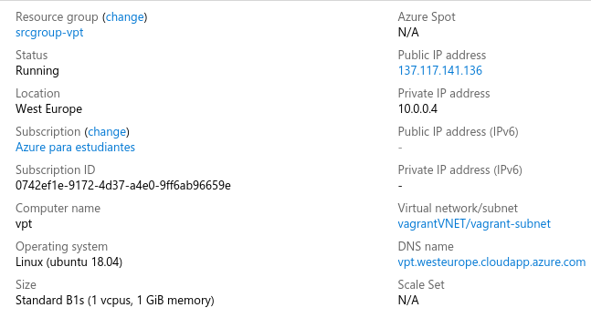

1. Primero creamos el grupo de recursos:

```bash
praxedes@praxedes-OMEN:~/Documents/ETSIIT/cuarto_curso/IV/IV_project$ az group create -l westeurope -n srcgroup-vpt
{
  "id": "/subscriptions/0742ef1e-9172-4d37-a4e0-9ff6ab96659e/resourceGroups/srcgroup-vpt",
  "location": "westeurope",
  "managedBy": null,
  "name": "srcgroup-vpt",
  "properties": {
    "provisioningState": "Succeeded"
  },
  "tags": null,
  "type": "Microsoft.Resources/resourceGroups"
}
```

2. Segundo creamos una asignación de role según nuestra subscripción:

```bash
praxedes@praxedes-OMEN:~/Documents/ETSIIT/cuarto_curso/IV/IV_project$ az ad sp create-for-rbac
Creating a role assignment under the scope of "/subscriptions/0742ef1e-9172-4d37-a4e0-9ff6ab96659e"
  Retrying role assignment creation: 1/36
  Retrying role assignment creation: 2/36
  Retrying role assignment creation: 3/36
  Retrying role assignment creation: 4/36
  Retrying role assignment creation: 5/36
{
  "appId": "4bcf38d7-65fb-4ddf-883a-5bad5f71e054",
  "displayName": "azure-cli-2020-01-10-11-07-46",
  "name": "http://azure-cli-2020-01-10-11-07-46",
  "password": "e344b007-b0db-4228-85d2-91c97f523472",
  "tenant": "c7a95d24-50ff-4804-ad9a-e4cba81ad10b"
}
```

3. Creamos Vagrantfile:

```ruby
```

4. Levantamos la máquina sin provisionarla:

```bash
praxedes@praxedes-OMEN:~/Documents/ETSIIT/cuarto_curso/IV/IV_project$ vagrant up --no-provision
Bringing machine 'vptournaments-vm' up with 'azure' provider...
==> vptournaments-vm: Launching an instance with the following settings...
==> vptournaments-vm:  -- Management Endpoint: https://management.azure.com
==> vptournaments-vm:  -- Subscription Id: 0742ef1e-9172-4d37-a4e0-9ff6ab96659e
==> vptournaments-vm:  -- Resource Group Name: srcgroup-vpt
==> vptournaments-vm:  -- Location: westeurope
==> vptournaments-vm:  -- Admin Username: vagrant
==> vptournaments-vm:  -- VM Name: vpt
==> vptournaments-vm:  -- VM Storage Account Type: Premium_LRS
==> vptournaments-vm:  -- VM Size: Standard_B1s
==> vptournaments-vm:  -- Image URN: Canonical:UbuntuServer:18.04-LTS:latest
==> vptournaments-vm:  -- TCP Endpoints: 80
==> vptournaments-vm:  -- DNS Label Prefix: vpt
==> vptournaments-vm:  -- Create or Update of Resource Group: srcgroup-vpt
==> vptournaments-vm:  -- Starting deployment
==> vptournaments-vm:  -- Finished deploying
==> vptournaments-vm: Waiting for SSH to become available...
Enter passphrase for /home/praxedes/.ssh/id_rsa:
==> vptournaments-vm: Machine is booted and ready for use!
==> vptournaments-vm: Rsyncing folder: /home/praxedes/Documents/ETSIIT/cuarto_curso/IV/IV_project/ => /vagrant
Enter passphrase for key '/home/praxedes/.ssh/id_rsa': 
==> vptournaments-vm: Machine not provisioned because `--no-provision` is specified.
```

5. Probamos a contectarnos con ssh:

```bash
praxedes@praxedes-OMEN:~/Documents/ETSIIT/cuarto_curso/IV/IV_project$ vagrant ssh
Enter passphrase for key '/home/praxedes/.ssh/id_rsa': 
Welcome to Ubuntu 18.04.3 LTS (GNU/Linux 5.0.0-1027-azure x86_64)

 * Documentation:  https://help.ubuntu.com
 * Management:     https://landscape.canonical.com
 * Support:        https://ubuntu.com/advantage

  System information as of Fri Jan 10 11:21:13 UTC 2020

  System load:  0.33              Processes:           115
  Usage of /:   6.8% of 28.90GB   Users logged in:     0
  Memory usage: 40%               IP address for eth0: 10.0.0.4
  Swap usage:   0%


0 packages can be updated.
0 updates are security updates.


vagrant@vpt:~$ 
```

6. Provisionamos la mv:

```bash
praxedes@praxedes-OMEN:~/Documents/ETSIIT/cuarto_curso/IV/IV_project$ vagrant provision
==> vptournaments-vm: Running provisioner: ansible...
Vagrant has automatically selected the compatibility mode '2.0'
according to the Ansible version installed (2.9.2).

Alternatively, the compatibility mode can be specified in your Vagrantfile:
https://www.vagrantup.com/docs/provisioning/ansible_common.html#compatibility_mode

    vptournaments-vm: Running ansible-playbook...

PLAY [all] *********************************************************************

TASK [Gathering Facts] *********************************************************
ok: [vptournaments-vm]

TASK [Update apt package list] *************************************************
changed: [vptournaments-vm]

TASK [Install Node.js] *********************************************************
ok: [vptournaments-vm]

TASK [Install git] *************************************************************
ok: [vptournaments-vm]

TASK [Install npm] *************************************************************
ok: [vptournaments-vm]

TASK [Create user] *************************************************************
ok: [vptournaments-vm]

TASK [Add public key for created user] *****************************************
ok: [vptournaments-vm]

TASK [Clone GitHub repository] *************************************************
ok: [vptournaments-vm]

TASK [Install packages based on package.json] **********************************
ok: [vptournaments-vm]

TASK [Install gulp] ************************************************************
ok: [vptournaments-vm]

TASK [Run gulp start] **********************************************************
changed: [vptournaments-vm]

PLAY RECAP *********************************************************************
vptournaments-vm           : ok=11   changed=2    unreachable=0    failed=0    skipped=0    rescued=0    ignored=0     
```

7. Miramos IP pública de nuestra máquina virtual:



8. Ya podemos conectarnos con el usuario creado y con la IP pública de la máquina que acabamos de consultar:

```bash
praxedes@praxedes-OMEN:~/Documents/ETSIIT/cuarto_curso/IV/IV_project$ ssh azure@137.117.141.136 -p 22
Enter passphrase for key '/home/praxedes/.ssh/id_rsa': 
Welcome to Ubuntu 18.04.3 LTS (GNU/Linux 5.0.0-1027-azure x86_64)

 * Documentation:  https://help.ubuntu.com
 * Management:     https://landscape.canonical.com
 * Support:        https://ubuntu.com/advantage

  System information as of Fri Jan 10 11:50:32 UTC 2020

  System load:  0.0               Processes:           107
  Usage of /:   8.3% of 28.90GB   Users logged in:     0
  Memory usage: 38%               IP address for eth0: 10.0.0.4
  Swap usage:   0%


19 packages can be updated.
16 updates are security updates.


Last login: Fri Jan 10 11:50:21 2020 from 213.194.177.167
azure@vpt:~$ 
```
